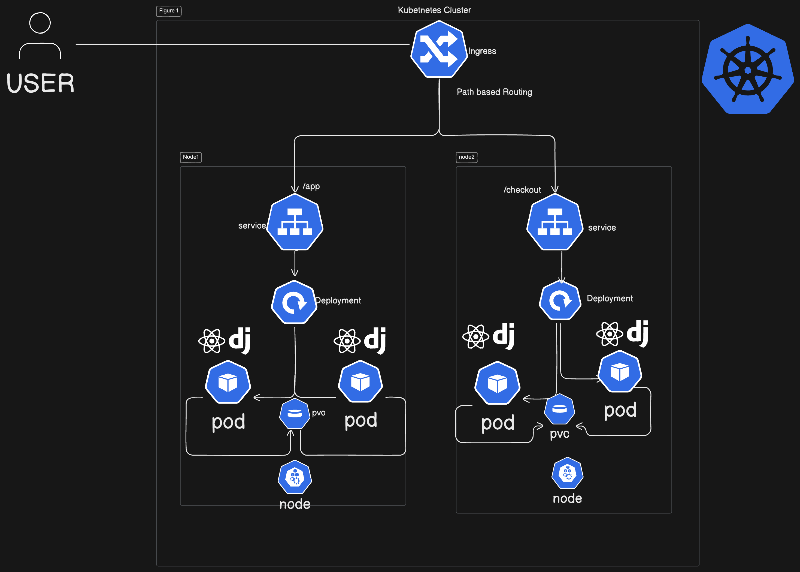

# Simple Notes App for Kubernetes.
This is a simple notes app built with React and Django. This is make In kind Cluster, Tailor it according to your environment

## Requirements
1. Python 3.9
2. Node.js
3. React

## Installation
1. Clone the repository
```
git clone https://github.com/Devilspsychiccoder/django-notes-app.git
```
2. Login to Docker
```
docker login -u thatgeekcontainer
```
3. Build the app
```
docker build -t notes-app .
```
4. Tag the Image
```
docker image tag notes-app-k8s:latest thatgeekcontainer/notes-app-k8s:latest
```
5. Push the Docker Image to your Docker Hub Account
```
docker push thatgeekcontainer/notes-app-k8s:latest
```
6. Run the app. The yaml files are already created as deployment and service
```
cd k8s_manifest
kubectl apply -f .
```
7. Make sure you portforward to make the application running
```
kubectl port-forward service/notes-app-service 8000:8000 --address=0.0.0.0 &
```
Troubleshooting Steps if encountered
```
Find the Process Using Port 8000. Run the following command to check which process is occupying port 8000:
sudo lsof -i :8000
If any other process listening to the port either kill it by sudo kill -9 <PID>
or change the port and make sure to add the port in the inbound rule in the security group.
```



